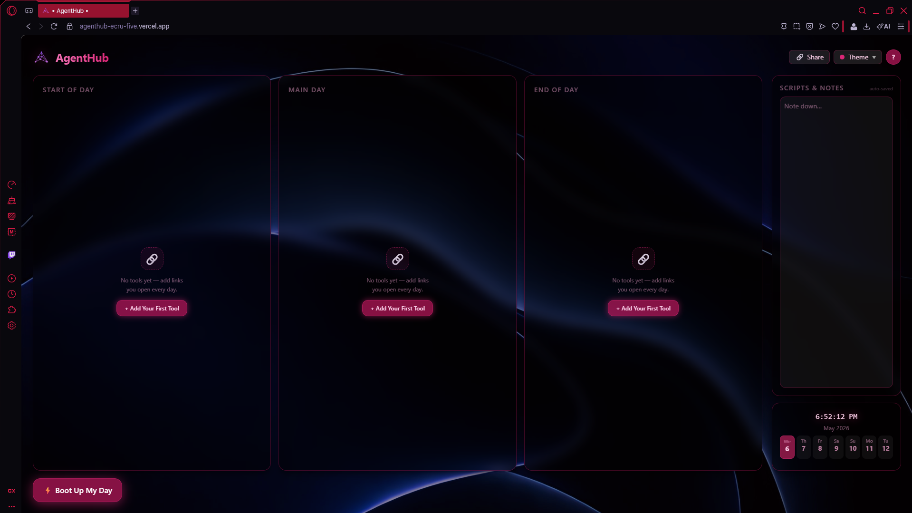
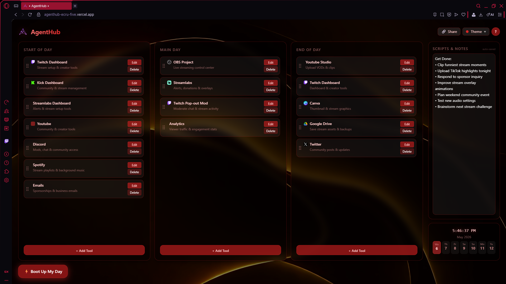
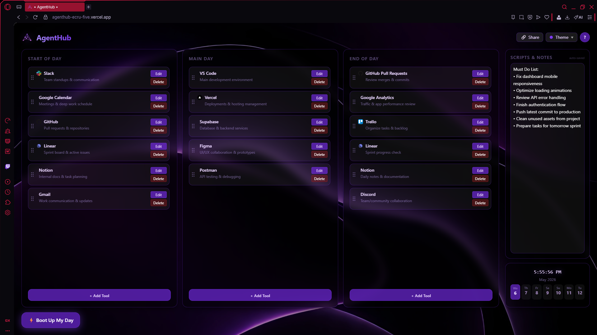
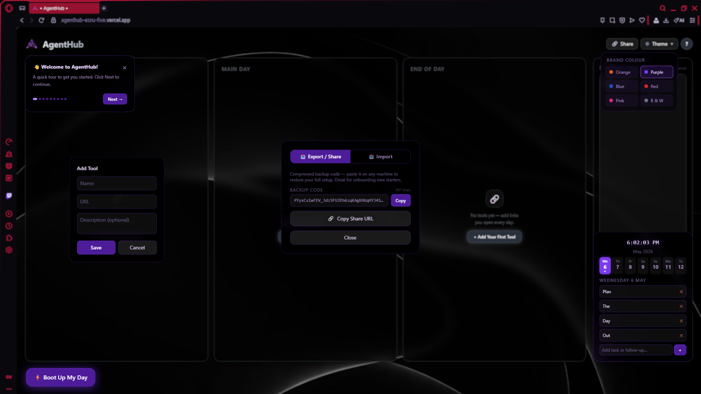

# AgentHub

> A lightweight productivity dashboard built to centralise the daily workflow of call centre agents — one tab, every tool, powered by AI.

[](https://agenthub-ecru-five.vercel.app)


---

## Core Concept

Call centre agents juggle multiple disconnected platforms throughout their day — CRMs, portals, knowledge bases, scheduling tools, Teams. Every tab switch adds friction and cognitive load.

AgentHub brings everything into a single customisable workspace, organised around how agents actually work: start of day, through the day, end of day. With the AI Assistant unlocked, agents can ask questions and get answers sourced directly from company-approved pages — no guessing, no searching.

---

## Feature Tiers

AgentHub operates in two modes. The core productivity suite is **free for everyone**. The AI Assistant is a **paid feature** unlocked per deployment via a System Unlock Key (SUK).

### Free — Core Productivity Suite

| Feature | Description |
|---|---|
| **Custom Tool Hub** | Three workflow columns (Start of Day, Main Day, End of Day) — add, edit, remove and rename tools |
| **One-Click Boot** | "Boot Up My Day" opens every Start of Day and Main Day tool in new tabs simultaneously |
| **Drag & Drop Reordering** | Organise tools by priority or workflow order within each column |
| **Smart Tool Icons** | Auto-fetches favicons for instant visual recognition of every tool |
| **Scripts & Notes** | Persistent scratchpad for call scripts, talking points, and shift notes — auto-saved |
| **Shift Scheduler** | Rolling 7-day calendar showing real dates — add reminders, follow-ups, and daily tasks |
| **Share & Backup** | Export your full setup as a compressed code — restore it on any machine instantly |
| **14 Colour Themes** | Brand-matched and custom colour themes with live switching |
| **Guided Tour** | Built-in interactive onboarding tour for new users |

### Paid — AI Assistant (SUK Required)

| Feature | Description |
|---|---|
| **AI Chat Widget** | Floating chat panel powered by Claude Haiku — fast, cost-efficient responses |
| **Source-Specific Search** | Add company URLs as sources; the AI fetches and answers exclusively from those pages |
| **Cited Answers** | Every source-based answer includes the URL the AI drew from |
| **Chat History** | Conversation persists across sessions via local storage |
| **SUK Gate** | Access controlled via a System Unlock Key — no key, no AI access |

---

## Screenshots

<table>
  <tr>
    <td></td>
    <td></td>
  </tr>
  <tr>
    <td></td>
    <td></td>
  </tr>
</table>

---

## Pricing Packages

The following packages are designed for businesses deploying AgentHub to their teams. The **Free** tier includes all core productivity features with no setup required.

### Free

- All core productivity features
- Unlimited tool columns and entries
- Shift scheduler and notes
- Share & backup system
- 14 colour themes
- No AI features

---

### AI Assistant Packages

The AI Assistant is powered by Anthropic's Claude Haiku model via a secure server-side proxy. Pricing below reflects estimated **operator API costs** (what it costs you to run), alongside **suggested retail pricing** to clients.

| Package | Agents | Monthly Price |
|---|---|---|
| **Starter** | 10 agents | $50–100 |
| **Growth** | 25 agents | $125–200 |
| **Business** | 50 agents | $250–400 |
| **Enterprise** | 100 agents | $500–1,000 |

> Pricing is per deployment. Contact for custom enterprise agreements or volume discounts.

---

## How the AI Assistant Works

1. The floating `🤖` button opens the AI chat panel
2. Users are prompted to enter the **System Unlock Key (SUK)** before gaining access
3. The SUK is validated server-side — it is never exposed to the browser
4. Once unlocked, agents can chat freely or add **company source URLs** via the `🔗` button
5. With sources active, the AI fetches each URL on every query using Jina Reader and answers exclusively from that content, citing the source URL in its response
6. All API calls are proxied through a Vercel serverless function — the Anthropic API key is never visible to end users

---

## Security & Privacy

| Concern | How AgentHub Handles It |
|---|---|
| **API key exposure** | Anthropic API key is stored in Vercel environment variables only — never in client code |
| **AI access control** | SUK validated server-side on every request — changing the key instantly revokes access |
| **Data storage** | All user data (tools, notes, schedule) is stored in browser local storage only — nothing sent to a server |
| **AI data privacy** | Anthropic does not train on API data by default |
| **Source content** | URLs are fetched at query time via Jina Reader and discarded after — not stored |

---

## Tech Stack

| Layer | Tech |
|---|---|
| **Framework** | React 19 (Vite 8) |
| **Styling** | Tailwind CSS 3 |
| **AI Model** | Claude Haiku 4.5 (Anthropic) |
| **API Proxy** | Vercel Serverless Functions (`/api/chat`, `/api/validate-key`) |
| **Source Fetching** | Jina Reader (`r.jina.ai`) |
| **Persistence** | Browser LocalStorage — client-side only |
| **Analytics** | Vercel Analytics |
| **Deployment** | Vercel |

---

## Getting Started

### Use It Instantly

No install required. All core features are available immediately:

[](https://agenthub-ecru-five.vercel.app)

---

### Run Locally (Core Features Only)

```bash
git clone https://github.com/Dev-Kyron/AgentHub.git
cd AgentHub
npm install
npm run dev
```

Open [http://localhost:5173](http://localhost:5173) in your browser.

---

### Run Locally (With AI Assistant)

The AI Assistant requires a server-side proxy to avoid CORS restrictions. You'll need two terminals running simultaneously.

**1. Copy the environment template and add your keys:**

```bash
copy .env.local.example .env.local
```

Edit `.env.local`:

```env
ANTHROPIC_API_KEY=sk-ant-your-key-here
SUK_KEY=your-system-unlock-key-here
```

**2. Start the local API server (Terminal 1):**

```bash
npm run dev:api
```

**3. Start the Vite dev server (Terminal 2):**

```bash
npm run dev
```

> Get an Anthropic API key at [console.anthropic.com](https://console.anthropic.com)

---

### Deploy to Vercel

1. Push the repository to GitHub
2. Import the project in Vercel
3. Add the following **Environment Variables** in Vercel project settings:

| Variable | Value |
|---|---|
| `ANTHROPIC_API_KEY` | Your Anthropic API key |
| `SUK_KEY` | Your chosen system unlock key |

4. Deploy — Vercel handles the serverless functions automatically

---

## Purpose

Built to solve a real-world problem observed in a call centre environment. Agents rely on too many disconnected systems — AgentHub reduces that friction by:

- Minimising tab switching and cognitive load
- Centralising tools around the natural rhythm of a shift
- Providing a personalised, shareable workspace per agent
- Giving agents instant, cited answers from company-approved sources via AI

---

## Roadmap

- [ ] Admin dashboard to manage SUK rotation and usage monitoring
- [ ] Per-agent usage analytics
- [ ] Shared team source libraries (admin-defined URLs pushed to all agents)
- [ ] Cloud sync for cross-device setups
- [ ] Team profiles and onboarding templates
- [ ] Tool categorisation and tagging
- [ ] Optional SSO / authentication layer
- [ ] Mobile-responsive layout

---

> **Copyright © 2026 Kyron (Dev_Kyron). All Rights Reserved.**
> This repository is public for portfolio and demonstration purposes only. Unauthorised commercial use is prohibited.
